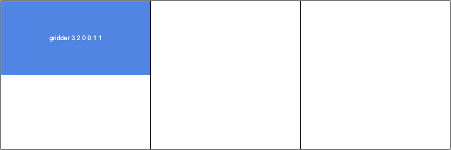

# gridder

Bash script that uses xdotool to move and resize the active window on a custom grid

## Installation

Download the file `gridder` to your machine and place it in any directory that's in your `$PATH` and make it executable with `chmod +x gridder`.

## Dependencies

- xdotool
- xdpyinfo

## Usage

### Syntax

```
gridder gridcols gridrows col row cols rows
```

### Parameters

```
gridcols    The number of columns in the grid.
gridrows    The number of rows in the grid.
col         The column at which to place the window. First column is zero.
row         The row at which to place the window. First row is zero.
cols        The width of the window in columns. Maximum is gridcols minus col.
rows        The height of the window in rows. Maximum is gridrows minus row.
```
### Examples

Top left on a 3x2 grid


Middle column full height on a 3x2 grid


